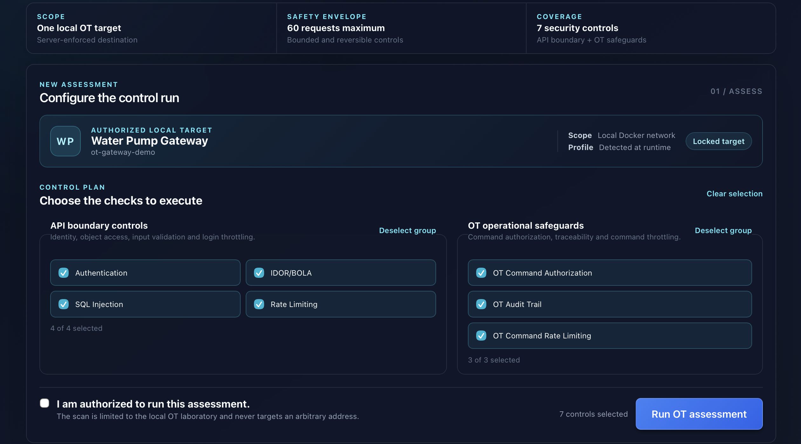
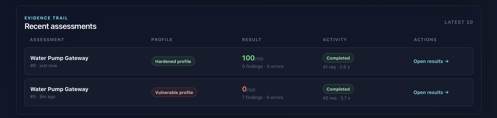
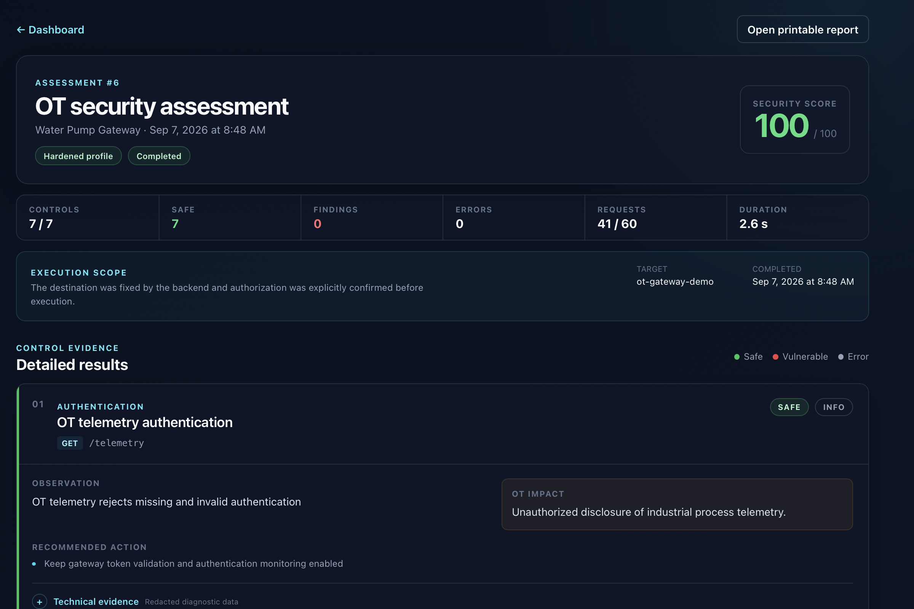
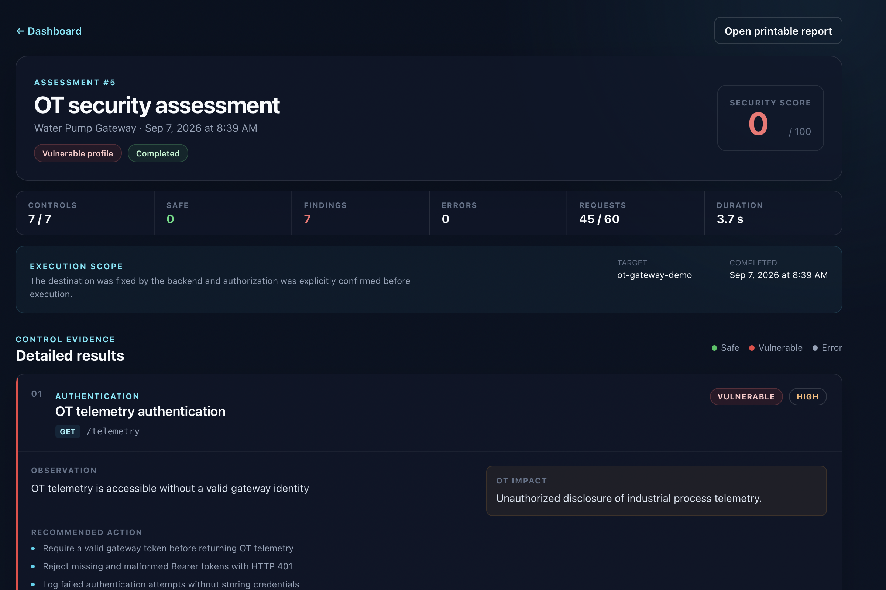

# IASS-OT — Industrial API Security Scanner

IASS-OT is a safe, deterministic learning environment for assessing the API security of a simulated water-pump gateway. It combines a React interface, a FastAPI scanner, PostgreSQL persistence, and a local OT gateway with intentionally vulnerable and hardened profiles.

The project is designed for demonstrations, portfolio review, and defensive security education. It never targets arbitrary URLs, real industrial equipment, or real industrial protocols.

> [!WARNING]
> This is an educational laboratory, not an IEC 62443 certification tool and not a production penetration-testing platform. Run it only in the provided local Docker environment.

## Project preview

### Bounded assessment configuration

The dashboard exposes one locked local target, the 60-request safety envelope, and the seven selectable API and OT controls.



### Deterministic profile comparison

The same assessment produces opposite, reproducible outcomes against the deliberately vulnerable and hardened gateway profiles.



### Hardened gateway result



### Vulnerable gateway result



## What the project demonstrates

- A closed server-side target policy that prevents arbitrary network scanning and SSRF.
- Seven bounded, non-destructive API and OT security controls.
- Opposite, deterministic results for `vulnerable` and `hardened` gateway profiles.
- A global limit of 60 outbound requests per assessment.
- Redacted evidence, explicit authorization confirmation, per-user scan ownership, and an HTML report designed for printing.
- A complete workflow: register, sign in, run an assessment, inspect findings, and print a sanitized report.

## Architecture at a glance

```text
Browser
  |
  v
Nginx :80 --------> React/Vite :5173       (development only)
  |
  +---------------> FastAPI scanner :8000 ----> PostgreSQL :5432
                              |
                              | fixed Docker-only destination
                              v
                     OT gateway demo :8081
                     (not published to the host)
```

The scanner accepts only the key `ot-gateway-demo`. The backend resolves that key to the internal Docker address; clients never submit a URL or gateway credential.

See [Architecture](docs/ARCHITECTURE.md) for trust boundaries, data flow, runtime behavior, and the data model.

## Prerequisites

- Docker Desktop with Docker Compose v2.
- Git.
- At least 4 GB of memory available to Docker.
- Ports `80`, `5173`, `8000`, and `5432` available, or changed in `.env`.

Node.js and Python are not required on the host for the documented Docker workflow.

## Quick start

1. Clone the repository and enter it:

   ```bash
   git clone <your-repository-url>
   cd industrial-api-security-scanner
   ```

2. Create the local environment file:

   ```bash
   cp .env.example .env
   ```

3. Start the development stack:

   ```bash
   docker compose -f dev.compose.yml up --build -d
   ```

4. Wait until every service is ready:

   ```bash
   docker compose -f dev.compose.yml ps
   ```

   The five services should be `running` or `healthy`: `ot-gateway-demo`, `db`, `backend`, `frontend`, and `nginx`.

5. Open [http://localhost](http://localhost) or [http://localhost:5173](http://localhost:5173).

6. Register a local account, sign in, keep the seven controls selected, confirm authorization, and run the assessment.

To stop the stack without deleting data:

```bash
docker compose -f dev.compose.yml down
```

To delete the local database volume and return to a completely fresh laboratory:

```bash
docker compose -f dev.compose.yml down -v
```

This last command permanently removes local accounts and assessment history.

## Gateway profiles

The gateway profile is selected when its container starts. It cannot be changed through an HTTP endpoint.

### Vulnerable profile

```bash
OT_PROFILE=vulnerable docker compose -f dev.compose.yml up -d --force-recreate ot-gateway-demo
```

This is the default development profile. It deliberately exposes authentication, authorization, validation, audit, and throttling weaknesses so that the scanner can detect them.

### Hardened profile

```bash
OT_PROFILE=hardened docker compose -f dev.compose.yml up -d --force-recreate ot-gateway-demo
```

The hardened profile enforces authentication, zone ownership, role checks, input validation, correlated audit events, and rate limits.

Run a new assessment after switching profiles. The backend reads the active profile from `/health` and stores that server-reported value with the scan.

## The seven controls

| Order | Control | Bounded behavior | Main finding severity |
|---:|---|---|---|
| 1 | Telemetry authentication | Two unauthenticated or invalid-token requests | High |
| 2 | Cross-zone BOLA/IDOR | Operators read their own and the other zone's pump | High |
| 3 | Maintenance-order SQL injection | One baseline and at most three harmless probes | Critical |
| 4 | Login rate limiting | At most eight invalid local logins | Medium |
| 5 | OT command authorization | Guest/operator pump command and unconfirmed emergency-stop checks | High/Critical |
| 6 | Correlated OT audit | Reversible pump command, audit lookup, then state restoration | High/Medium |
| 7 | OT command rate limiting | At most eight idempotent stop commands | High/Low |

The full run always uses this order. Each result is committed immediately, so an error in a later control does not erase earlier results.

## Score and execution status

The score is intentionally simple and explainable:

```text
score = max(0, 100 - 30×Critical - 15×High - 7×Medium - 2×Low)
```

Only vulnerable results reduce the score. Safe results and technical errors do not. Errors are reported separately.

Execution status describes whether the assessment ran correctly; it does not describe whether the target is secure:

- `running`: persisted before control execution.
- `completed`: every selected control returned a result.
- `partial`: at least one result exists and at least one control failed technically.
- `failed`: the reset failed or no control produced a usable result.

## Reports

Open any completed assessment and select **Open printable report**. The route `/scans/{id}/report` renders a client-side HTML report with:

- assessment scope and gateway profile;
- score, result counts, request count, and duration;
- observations, OT impact, and recommended actions;
- an explicit educational-use limitation.

Raw evidence, credentials, tokens, cookies, and internal response excerpts are excluded from the printable report. Use the browser's **Print or save as PDF** action when a PDF copy is needed.

## Validation

Run the complete containerized quality suite:

```bash
just check
```

Equivalent commands are:

```bash
docker build --target test -f conf/docker/dev/fastapi.docker -t iass-backend-test:local .
docker run --rm iass-backend-test:local \
  sh -lc 'ruff check . && pytest -p no:cacheprovider'

docker build --target test -f ot-gateway-demo/Dockerfile -t iass-ot-gateway-test:local .
docker run --rm iass-ot-gateway-test:local \
  sh -lc 'ruff check --no-cache app tests && pytest -p no:cacheprovider'

docker compose -f dev.compose.yml run --rm --no-deps frontend \
  sh -lc 'pnpm run typecheck && pnpm run lint && pnpm run lint:scss && pnpm run build'
```

The backend test suite covers the target allowlist, request budget, redirect blocking, response-size cap, recursive redaction, all seven scanners, scoring, persistence, pagination, and ownership checks. The gateway suite verifies both profiles, state reset, RBAC, audit, rate limiting, and safe command behavior.

Recorded v1.0 results, fresh-build timing, runtime health, and the two-profile comparison are available in [Validation record](docs/VALIDATION.md).

## Main API routes

| Method | Route | Purpose |
|---|---|---|
| `POST` | `/auth/register` | Create a local platform account |
| `POST` | `/auth/login` | Obtain a platform JWT |
| `POST` | `/scans/` | Execute selected controls against the fixed target |
| `GET` | `/scans/` | Return the authenticated user's latest assessments |
| `GET` | `/scans/{id}` | Return one owned assessment and its results |
| `DELETE` | `/scans/{id}` | Delete one owned assessment |
| `GET` | `/health` | Backend health check |

Interactive backend documentation is available at [http://localhost:8000/docs](http://localhost:8000/docs) in development.

## Repository map

```text
backend/                 FastAPI API, orchestration, scanners, persistence, tests
frontend/                React interface and printable client-side report
ot-gateway-demo/         Deterministic simulated water-pump gateway and tests
conf/                    Docker and Nginx configuration
docs/                    Architecture, security decisions, validation, and demo guide
compose.yml              Hardened production-oriented stack
dev.compose.yml          Local development stack with five services
```

## Security boundaries

- The OT gateway is reachable only on the Compose network by default.
- Scanner redirects are disabled.
- Connect and read timeouts are 3 and 5 seconds.
- Responses are capped at 1 MiB and evidence excerpts at 500 characters.
- A shared request budget stops the 61st request.
- Sensitive keys are recursively redacted before persistence.
- Platform JWTs and gateway demonstration JWTs use separate secrets and purposes.
- The scanner never sends the emergency-stop confirmation header.

Read [SECURITY.md](SECURITY.md) before changing the target policy, scanner HTTP client, payloads, or gateway exposure.

## Demonstration

The repeatable interview/demo sequence is documented in [Demo guide](docs/DEMO.md). It is designed to take approximately 5–7 minutes and includes both gateway profiles.

## Attribution and license

This adaptation is based on Carter Perez's **API Security Scanner** from the `Cybersecurity-Projects` repository at source commit [`30d6078b8ef28f52df06b12e1312caeeb8875415`](https://github.com/CarterPerez-dev/Cybersecurity-Projects/tree/30d6078b8ef28f52df06b12e1312caeeb8875415/PROJECTS/intermediate/api-security-scanner).

The original attribution notices have been retained. This repository is distributed under the [GNU Affero General Public License v3.0](LICENSE).
